Task 1: Create a Basic Dockerfile for Nginx

In Task1   I :

1.Launched an Amazon EC2 Ubuntu instance 
Then updated 
sudo apt update
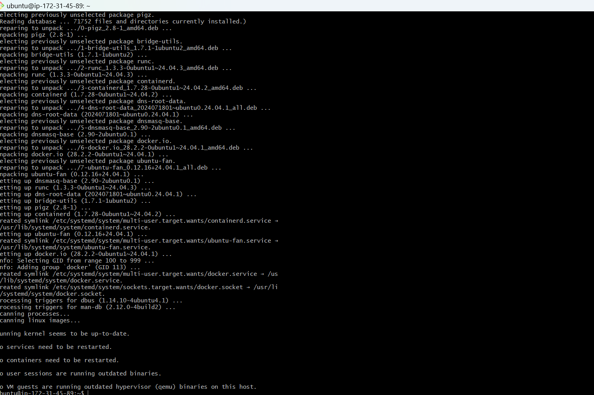

2.Installed Docker On EC2

sudo apt install docker.io -y

sudo systemctl start docker
sudo systemctl enable docker

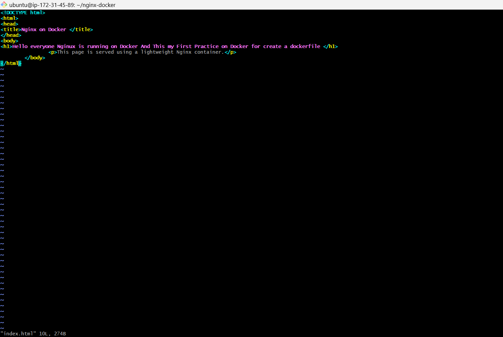

3.Created a Dockerfile using lightweight nginx:alpine image
  vim  Dockerfile
  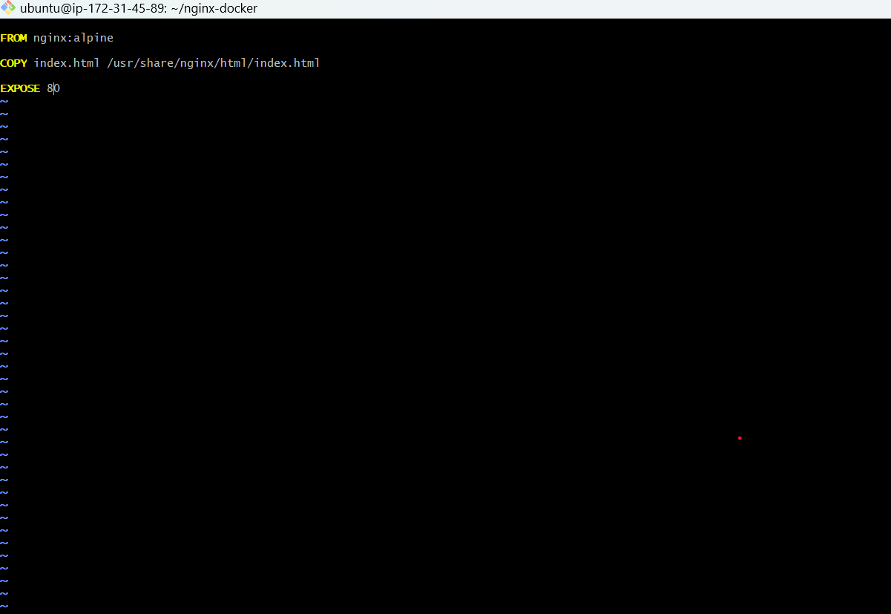

4.Built the docker image
    sudo docker build -t nginx-image-ec2:1.0 .

  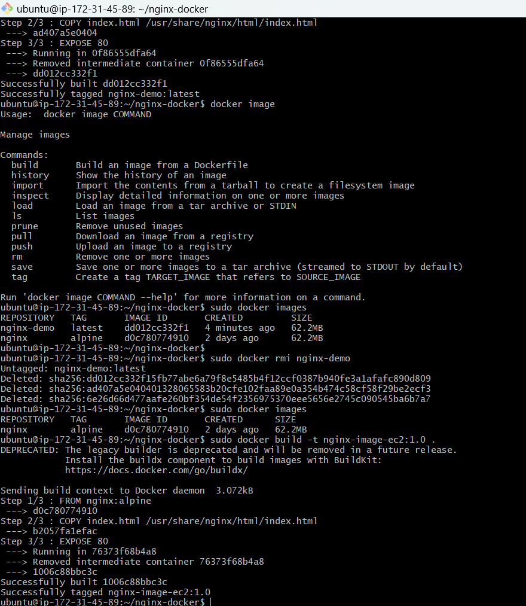

 5 Run the container
   
     sudo docker run -d -p 80:80 nginx-image-ec2:1.0

  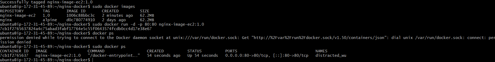

7.Successfully served a webpage from the Docker container

 

 Task 2: Create Dockerfile for Python
 Objective

 Create a Dockerfile to containerize a Python application so it can run consistently across environments.

   Project Structure:

python-app/
│
├── app.py
├── requirements.txt
└── Dockerfile

 
     
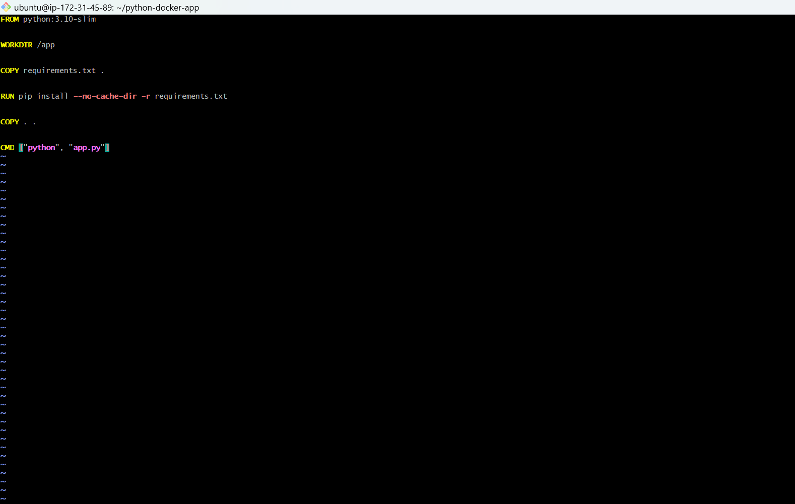

Dockerfile:

  

  Build the Docker Image and Run the Container

  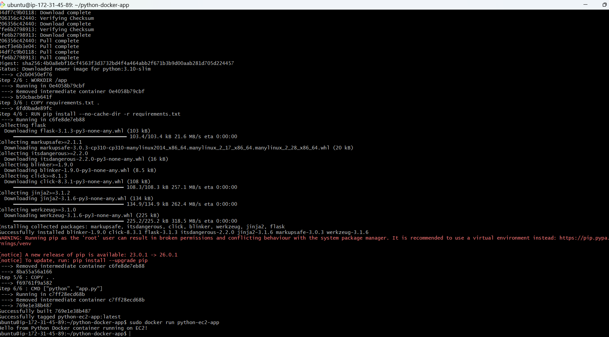

  Task2 Completed:

1.Created Python app

2.Created Dockerfile

3.Built Docker image

4.Ran container on EC2 Ubuntu

Task 3: Create a 3-tier Application

Technologies used:

-Frontend (Nginx)
-Backend (Node.js)
-Database (MySQL)

Docker Features used:
-Custom Bridge Network
-Named Volumes
-Docker Compose

  Here are the steps which I followed to complete the task

Step 1: Launched Ubuntu EC2 Instance

Step 2: Connected to EC2 via SSH

Step 3: Updated Ubuntu System

         sudo apt update
         sudo apt upgrade -y

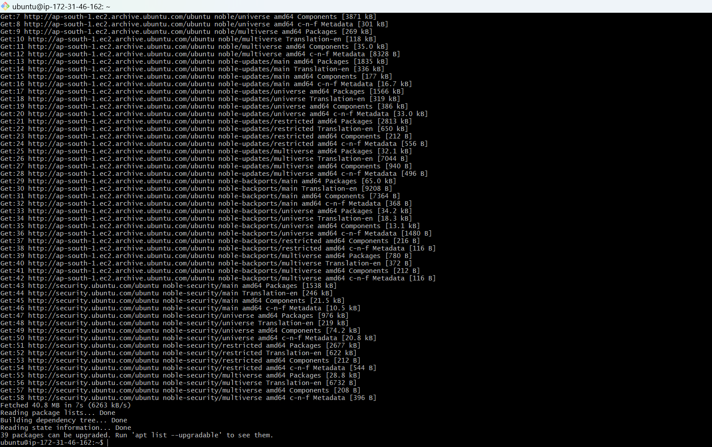

Step 4: Installed Docker
         sudo apt install docker.io -y

         Start Docker:

         sudo systemctl start docker
         sudo systemctl enable docker
         Checked Docker Version:
         docker --version

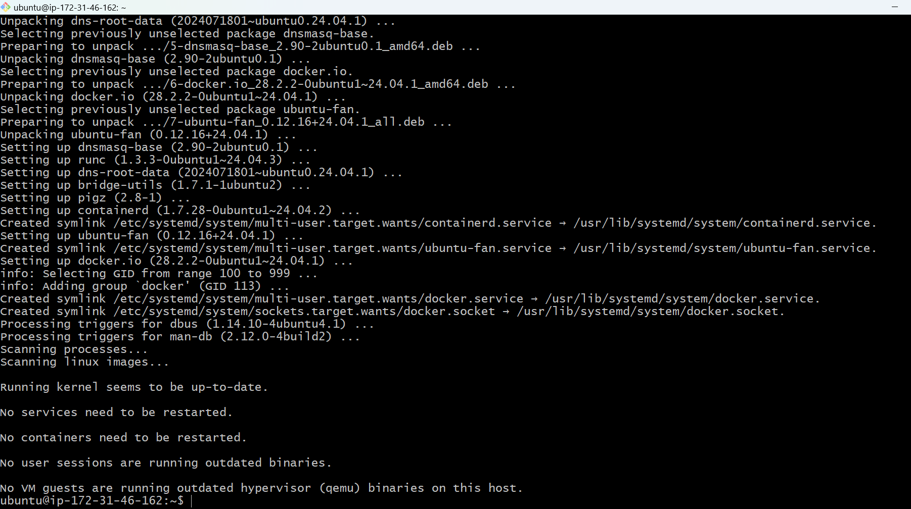

Step 5: Installed Docker Compose
        sudo apt install docker-compose -y
        verified:

        docker-compose --version
  

Step 6: Created Project Directory

    mkdir 3tier-docker-app
    cd 3tier-docker-app

    Creater folders:

    mkdir backend
    mkdir nginx

Project Structure:

3tier-app
│
├── backend
└── nginx

Step 7: Created Node.js Backend

Move to backend folder:

 cd backend
 Created application file:
 vim app.js

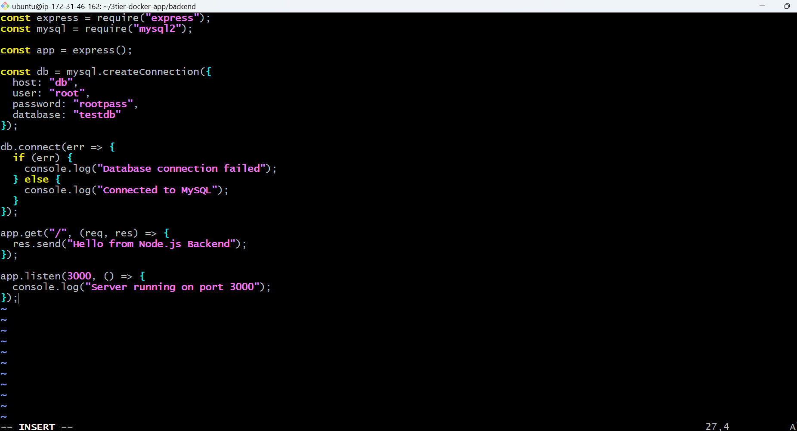

Step 8: Created Backend Dockerfile
Command used:
vim Dockerfile

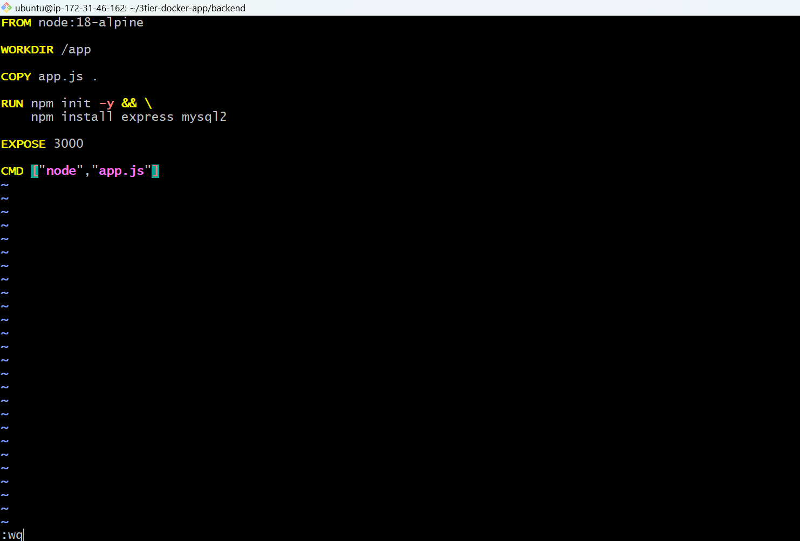

Step 9: Created Nginx Configuration
Go back to nginx folder:
cd ..

cd nginx
Here Created  config file:
vim default.conf

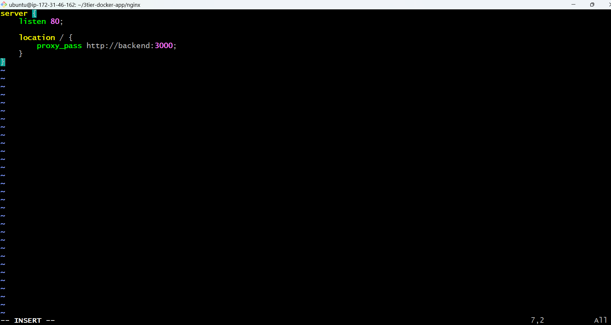

Step 10: Created Docker Compose File
Return to root directory:
cd ..

Created  Docker comose File by command :
vim docker-compose.yml
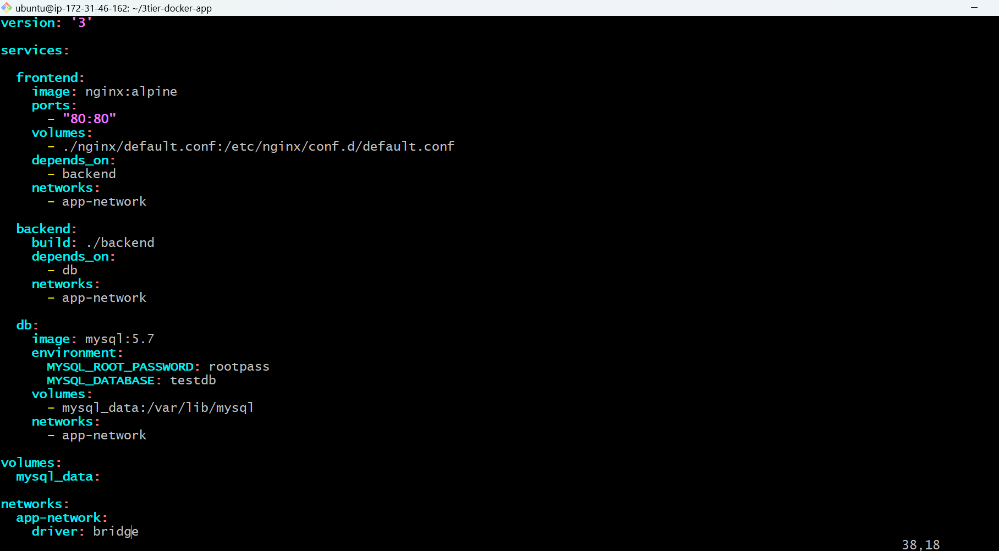

Step 11: Start Application

Run:
sudo docker-compose up -d

Checked containers:
sudo docker ps
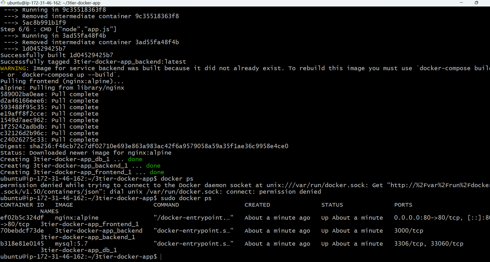

Step 12: Verified Custom Bridge Network
 Command used:
 sudo docker network ls

Inspected:
sudo docker network inspect app-network
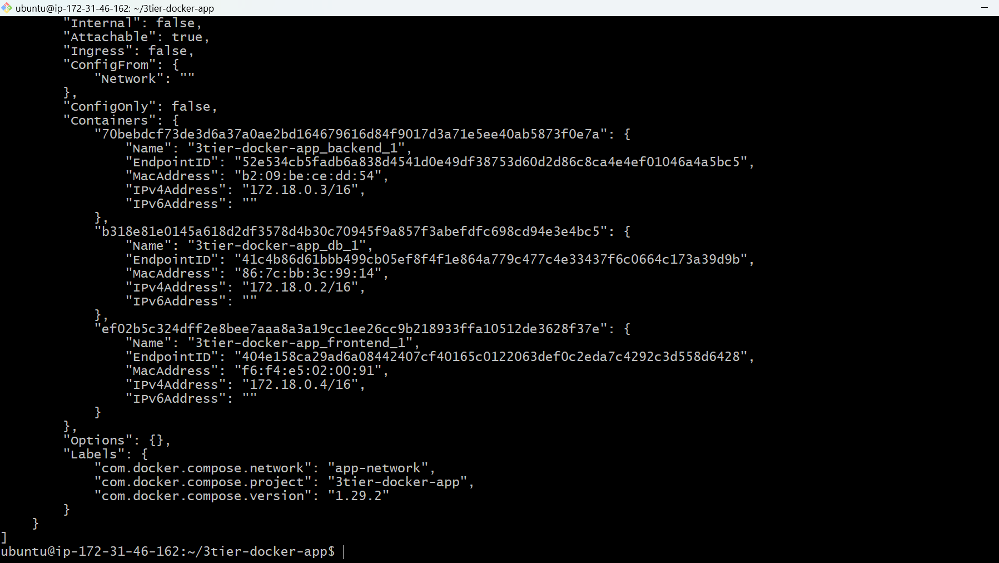

Step 13: Verify Named Volume
sudo docker volume ls
Output expected:
    mysql_data
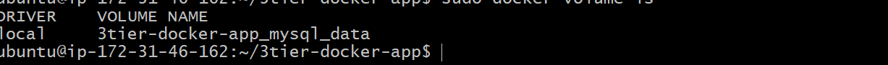

Step 14: Test the Application
Open browser:

http://<EC2-PUBLIC-IP> // Because Here I used EC2 Ubuntu Instance for Perform the task

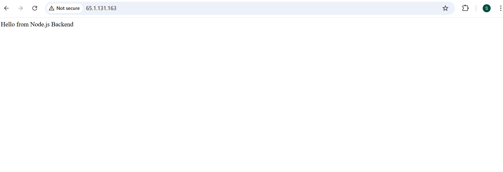

Project Structure:

3tier-docker-app
│
├── docker-compose.yml
├── backend
│   ├── Dockerfile
│   └── app.js
│
└── nginx
    └── default.conf

Conclusion:

Task3 completed successfully & demonstrated:

Deploying a 3-tier architecture

Using Docker Compose

Created a custom bridge network

Implemented named volumes for persistent storage

Ran containers on an Ubuntu EC2 instance

Note: Lightweight Alpine-based Docker images were used for the frontend and backend services to reduce image size and improve container startup performance.

Frontend :nginx:alpine
Backed:  node:18-alpine
Database: mysql:5.7
