Project: Realtime Chat App with Docker Volumes

This is a Node.js real-time chat app running in Docker with all 5 volume types demonstrated: anonymous, named, bind mount, tmpfs, and DB persistent volume.

Prerequisites

Ubuntu EC2 instance

Docker & Docker Compose installed

Node.js & npm installed (for backend dependencies)

Node.js + WebSocket chat app with PostgreSQL. Here’s how each volume type fits:

Node.js + WebSocket container > Handles real-time connections.

Uses tmpfs for< > active message buffers (fast memory access).

Writes logs to bind-mounted folder> for host monitoring.

Stores non-critical temporary files in> anonymous volume.

Stores persistent attachments in> named volume.

Step by Step  Instructions which I followed to complete this task:

Step 1: Updateed Ubuntu and Installed Docker

Update packages:

sudo apt update -y && sudo apt upgrade -y

Step2: Installed Docker & Docker-Compose:

sudo apt install -y docker.io
sudo apt install -y docker-compose

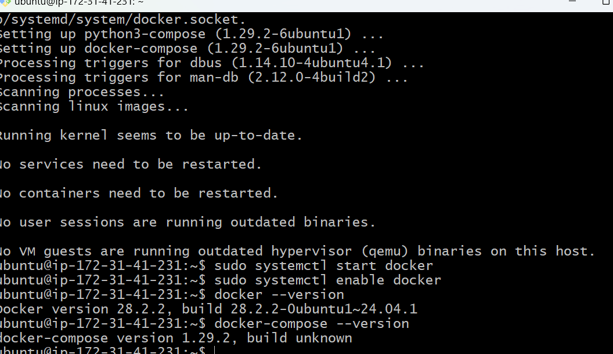

Step 3: Created Project Folders
mkdir -p ~/realtime-chat-app/backend ~/realtime-chat-app/data ~/realtime-chat-app/tmp
cd ~/realtime-chat-app
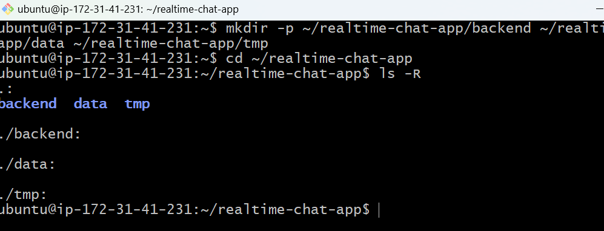

>backend → Node.js code

>data → bind mount folder (host folder)

>tmp → optional temp storage

Step 4: Initialize Node.js App

Go to backend folder:
cd backend

Initialize Node.js project:
npm init -y

Installed dependencies:npm install express socket.io

Note: express is the web server, socket.io is for real-time chat.

Step 5: Created Backend Files
vim app.js

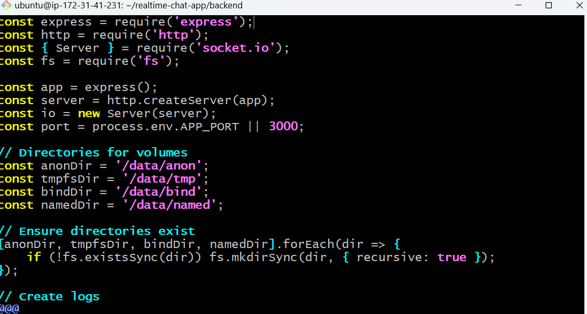

index.html:
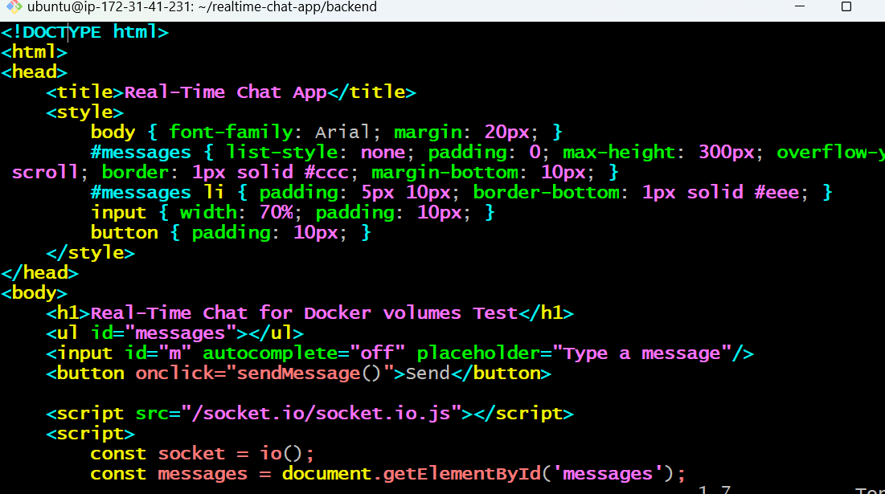

Step 6: Created Multi-Stage Dockerfile
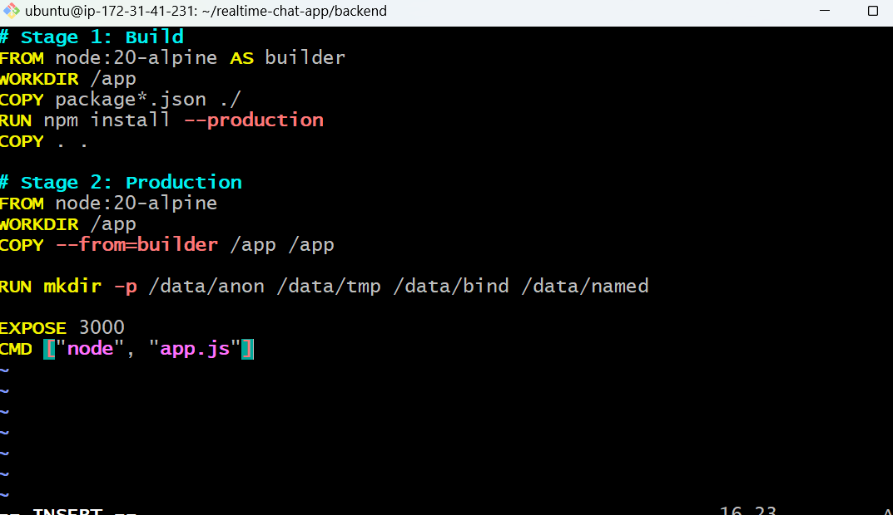

Step 7: Created Docker Compose File

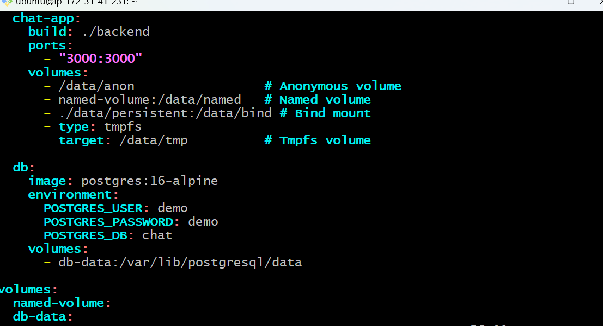

Now go Go back to root:

cd ~/realtime-chat-app
vim docker-compose.yml

Step 8: Build and Run Containers

sudo docker-compose up -d --build
Check containers:
docker ps
Here we will see chat-app and db running.

Step 9: Test Chat App
   
Open browser: http://<EC2-Public-IP>:3000
http://43.204.25.214:3000

Open multiple tabs.

Send messages → should appear in all tabs.

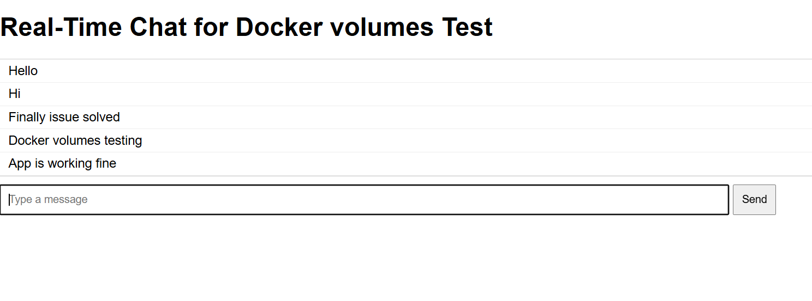

Step 10: Verify Docker Volumes
# List volumes
docker volume ls

# Check named volume content
docker run --rm -v named-volume:/data busybox ls /data

# Check tmpfs content
docker exec -it <chat-app-container-id> ls /data/tmp

# Check bind mount logs
ls -l ./data/persistent
docker volume ls
docker run --rm -v named-volume:/data busybox ls /data
docker exec -it <chat-app-container-id> ls /data/tmp
ls -l ./data/persistent
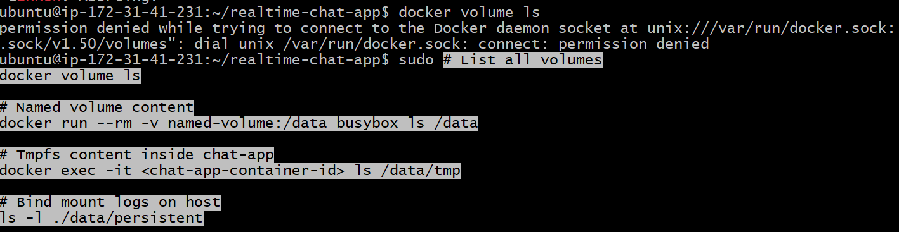

Verified all 5 types of Docker volumes:

Anonymous: /data/anon

Named: /data/named

Bind: ./data/persistent

Tmpfs: /data/tmp

DB named volume: /var/lib/postgresql/data
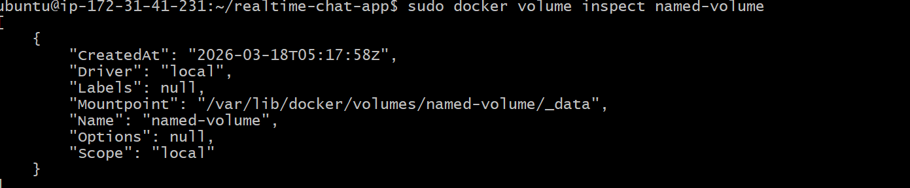

Step 11: Stop Containers
docker-compose down
docker volume ls
Note: Here docker volume ls showing named volumes persist and anonymous removed.
Note: Containers stopped. Named volumes and DB volume persisted; anonymous volumes removed.
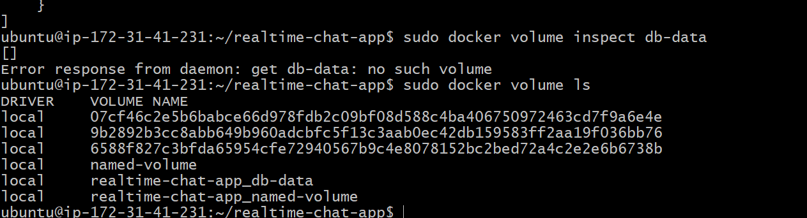

Step 12: Notes some important points:
Anonymous Volume: Temporary, auto-created.

Named Volume: Persistent, survives container rebuilds.

Bind Mount: Maps host folder to container.

Tmpfs: In-memory ephemeral storage.
DB Volume: Persistent database storage.

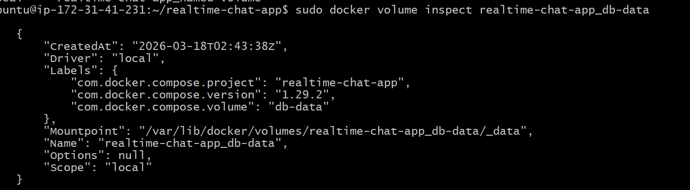

All volumes:
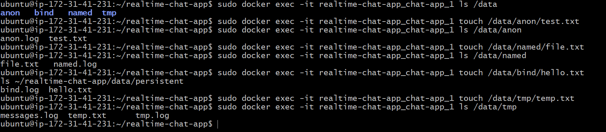

Check chat-app logs
sudo docker-compose logs -f chat-app
here we see
Server running on port 3000

Application is now fully running on EC2 + Docker + Browser

